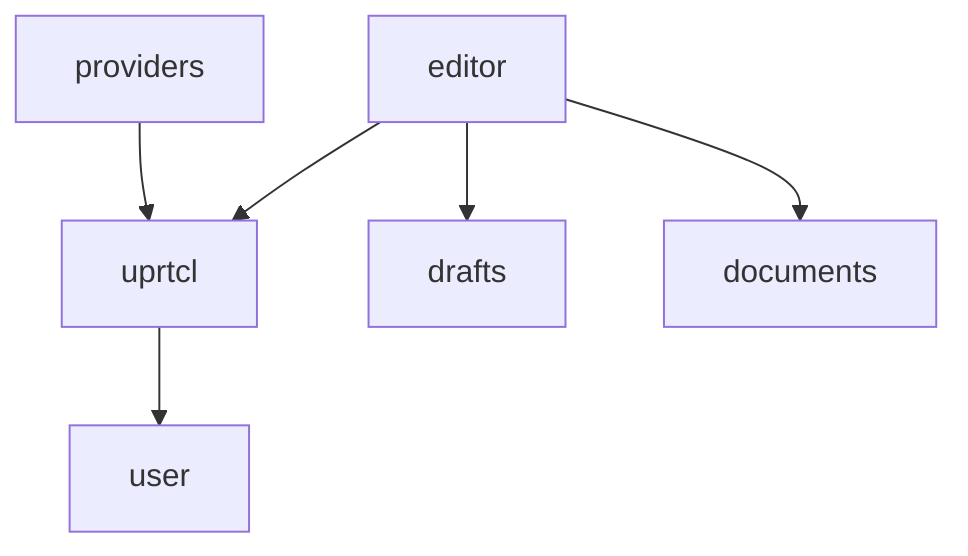

### Responsabilities of each module:
- User: deal with the user information and expose it to the UI

- Uprtcl: deal with basic context, perspectives and commit objects
- Providers: add multiplatform features to Uprtcl

- Draft: update drafts for a given element id
- Data: get and create TextNode data

- Editor: aggregate uprtcl, draft and data funcionality and expose it to the frontend
